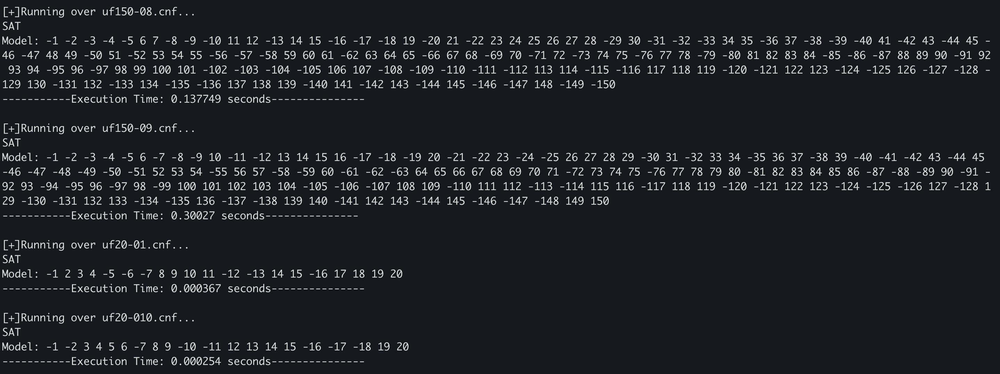

<h1>SAT SOLVER Based on DPLL</h1></br>
We have implemented an efficient SAT SOLVER using DPLL and some heuristics. It is implemented in C++ for lower solving times.
<h3>Index</h3>
<ul>
	<li><a href="#install">Installation</a></li>
	<li><a href="#preprocess">Pre Processing</a></li>
	<li><a href="#algo">Algorithm</a></li>
	<li><a href="#heuristics">Heuristics</a></li>
	<li><a href="#glossery">Glossery</a></li>
</ul>
<h2 id = "install">Installing and Running The Solver</h2>
For using this sat solver extract all

the contents of zip file into another folder. Open unix terminal and ```cd```
into the extracted solver directory.Using ```ll```
check that **run_all_cases.sh** has executable permissions for the current user. If not, execute the following command:</br>
<center>

```sudo chmod +x run_all_cases.sh```
</center></br>
<h3>Input</h3>
<p>Put the test file(s) in Testcases folder. The input file must be in DIMACS format.</p>
<h3>Output</h3>

If the solver is running on 
```test.cnf```, 
then output will be as follows:
<li>UNSAT/SAT</li>
<li>Model if SAT</li>
<li>Execution time in seconds</li>
</br>
Now run the following command to run the SAT SOVLER on all the testcases in <i>Testcases</i> folder.
</br>
<center>

```./run_all_cases.sh```
</center>
</br>
</br>
<h2>Alogrithm and Heuristics</h2>
We have used DPLL as base algorithm along with some heuristics to build SAT SOVLER. The main difference which makes this SOLVER so efficient is that we backtrack using decision levels and not single literals.
<h3 id="preprocess">Pre Processing Details</h3>
We start with reading the input into the respective data structures (see comments in the code for more details), and after populating the data structures, <i>filterClauses</i> function is called which :
<ul>
	<li>Removes the <a href="#glossery">Unit Clauses</a> from the original clauses and sets the literal to true. If we encounter two unit clauses which contain opposite literals, then we exit the solver and output UNSAT. </li>
	<li>Removes the <a href = "#glossery">Tautoligies</a> from the remaining clauses.</li>
	<li>Removes the clauses containing <a href = "#glossery">Pure Literals</a> from the remaining ones.</li>
</ul>

Now ```initializePosandNegClauses``` initializes two array of array of addressses corresponding to clauses containing the respective literal in positive state and negative state.</br>
Finally after all the pre-processing has been done, we move to the actual solving part. 

<h3 id="algo">Algorithm</h3> 

A ```model_stack``` is maintained which contains decision levels propogated till now. A decision level is created by pushing literals to the stack and checking for conflicts in that decision level. If conflict arises in any clause, program backtracks to previous decision level and again push first literal in removed decision level, but in opposite state. Along with that value of that literal in <i>model</i> is also changed. The removed literals are set to ```UNDEFINED```. Program checks for conflicts and backtrack till it reaches ```DECISION_LEVEL=0``` or get no conflict before that. If first case occurs, program exits with UNSAT. Else it continues to next decision level by choosing next literal to propagate. Two adjacent decision levels are seperated by ```0``` between them in the ```model_stack```. The next literal to propagate is chosen by a special heuristic. If it is 0, then the program exits by SAT and gives the required model.     
<h3 id = "heuristics">Heuristics</h3>
<h4>Activity based Decision Heuristic</h4>
	<p>The heuristic used to choose the next literal to be decided by the DPLL algorithm has also been updated with respect of what was implemented in the example code that was provided.</p>
	<p>The decision heuristic works as follows:</p>
	<ul>
		<li>An activity counter is kept for each literal, be it positive or negative, indicating the number of conflicts in which the literal was involved.</li>
		<li>Each time a conflict is found, the activity of all the literals in the clause that causes the conflict is incremented by a constant factor (1, in our case).</li>
		<li>When a new decision has to be made, the literal with the highest activity of those variables still undefined in the model is chosen and returned to the DPLL procedure.</li>
	</ul>

<h4>Inference based Heuristic</h4>

Another heuristic implemented is that whenever during checking for conflicts, program finds a clause which has all of its literals set to ```FALSE``` except for one ```UNDEFINED```, then it sets the literal to ```TRUE``` and pushes it to the current decision stack. It considerably reduces the execution time as number of literals to propagate reduces in constant operation time.

<h2>Testbench</h2>
We tested our solver on the provided testcases, and the Solver was able to process all the testcases in the zip file under 2 minutes.
<h2>Execution Results</h2>



</br>

<div id="glossery">
	<h3><strong>Glossery</strong></h3>
	<strong>Unit Clauses:</strong> The clauses which contain only one literal. For them to satisfy, that literal must be true. </br>
	<strong>Tautology:</strong> The clause which is always true, irrespective of the interpretation of the literals. </br>
	<strong>Pure Literals:</strong> They are the literals that for which their negation is not present in any of the clauses. They can be assumed to be true and then all the clauses containing 'a' can be deleted and all the clauses '-a' can be reduced by in size by eliminating '-a'.</br>
</div>

